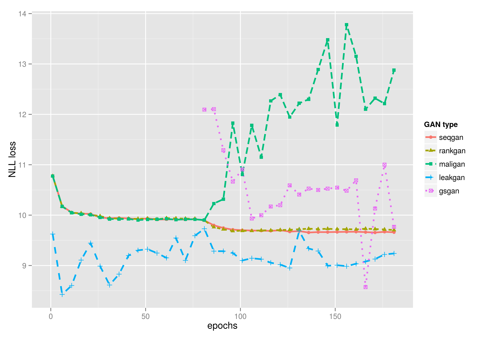
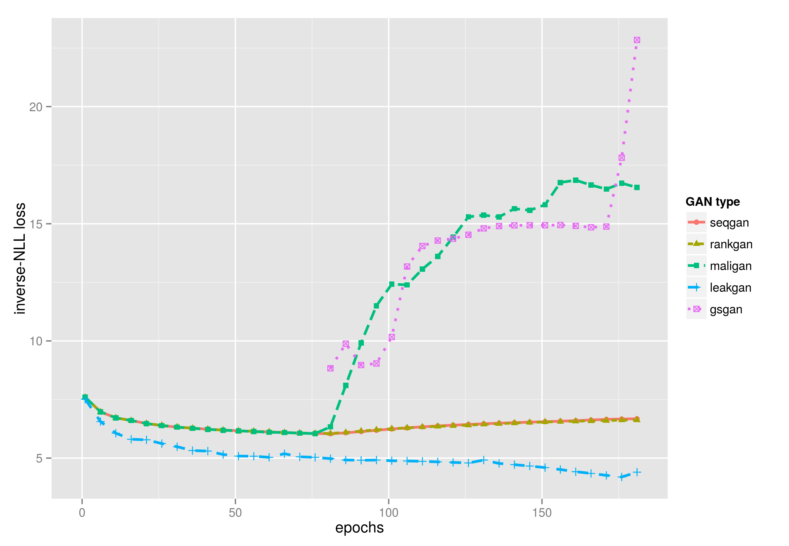

## Evaluations:

#### Metrics

Paper #TODO

#### Experiment Results
nll loss on oracle:

inverse nll loss on oracle:

embedding similarity on image coco:

BLEU:

on original dataset:

|            | seqGAN | maliGAN | rankGAN | leakGAN |
|------------|--------|---------|---------|---------|
| BLEU2      | 0.917  | 0.887   | 0.937   | 0.926   |
| BLEU3      | 0.747  | 0.697   | 0.799   | 0.816   |
| BLEU4      | 0.530  | 0.482   | 0.601   | 0.660   |
| BLEU5      | 0.348  | 0.312   | 0.414   | 0.470   |

on test dataset:
// calculating...

Mode Collapse (self-BLEU):

|            | seqGAN | maliGAN | rankGAN | leakGAN | original data |
|------------|--------|---------|---------|---------|---------------|
| BLEU2      | 0.950  | 0.918   | 0.959   | 0.966   | 0.892         |
| BLEU3      | 0.840  | 0.781   | 0.882   | 0.913   | 0.747         |
| BLEU4      | 0.670  | 0.606   | 0.762   | 0.848   | 0.573         |
| BLEU5      | 0.489  | 0.437   | 0.618   | 0.780   | 0.415         |
