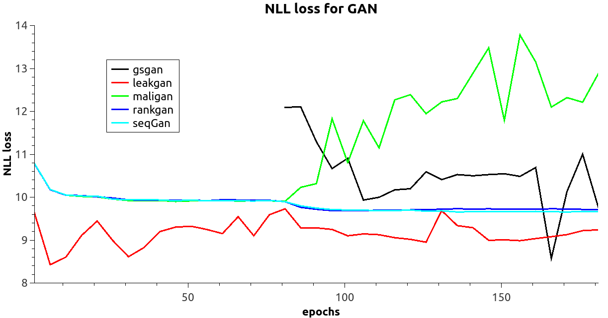

# Evaluation Platform for Text Generation #

###Models and Original Paper:

seqGan--  [SeqGAN: Sequence Generative Adversarial Nets with Policy Gradient](https://arxiv.org/abs/1609.05473)

maliGan-- [Maximum-Likelihood Augmented Discrete Generative Adversarial Networks](https://arxiv.org/abs/1702.07983)

rankGan-- [Adversarial ranking for language generation](http://papers.nips.cc/paper/6908-adversarial-ranking-for-language-generation)

leakGan-- [Long Text Generation via Adversarial Training with Leaked Information](https://arxiv.org/abs/1709.08624)

textGan-- [Adversarial Feature Matching for Text Generation](https://arxiv.org/abs/1706.03850)
 (need discussion)
 
gsGan-- [GANS for Sequences of Discrete Elements with the Gumbel-softmax Distribution](https://arxiv.org/abs/1611.04051)

### Evaluations:

nll loss on oracle:

inverse nll loss on oracle:

embedding similarity on image coco:

BLEU:

on original dataset:

|            | seqGAN | maliGAN | rankGAN | leakGAN |
|------------|--------|---------|---------|---------|
| BLEU2      | 0.917  | 0.887   | 0.937   | 0.926   |
| BLEU3      | 0.747  | 0.697   | 0.799   | 0.816   |
| BLEU4      | 0.530  | 0.482   | 0.601   | 0.660   |
| BLEU5      | 0.348  | 0.312   | 0.414   | 0.470   |

on test dataset:
// calculating...

Model Collapse:

| type\\fold | seqGAN | maliGAN | rankGAN | leakGAN | original data |
|------------|--------|---------|---------|---------|---------------|
| BLEU2      | 0.950  | 0.918   | 0.959   | 0.966   | 0.892         |
| BLEU3      | 0.840  | 0.781   | 0.882   | 0.913   | 0.747         |
| BLEU4      | 0.670  | 0.606   | 0.762   | 0.848   | 0.573         |
| BLEU5      | 0.489  | 0.437   | 0.618   | 0.780   | 0.415         |
