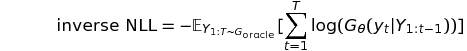
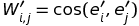
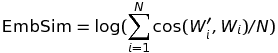
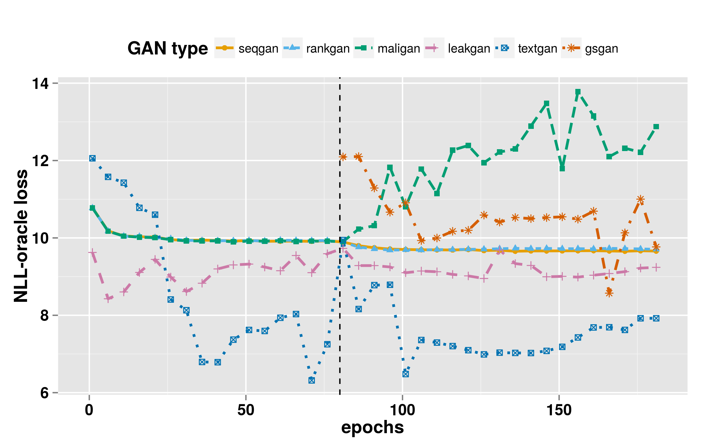
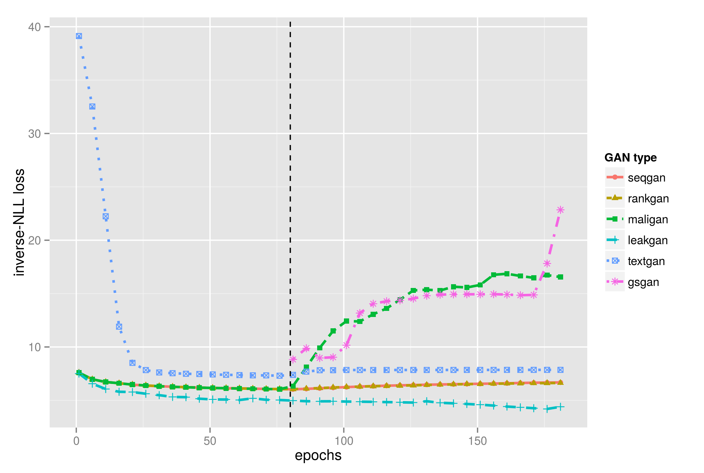
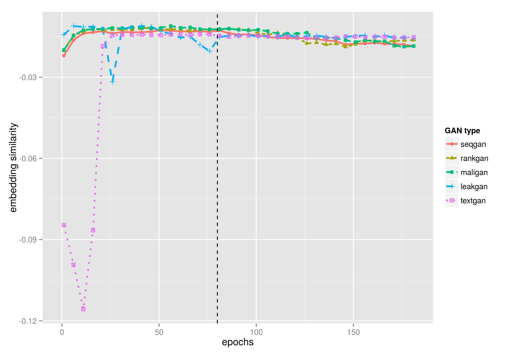

## Evaluation


### Metrics

#### NLL-oracle loss

NLL-oracle loss is originally proposed by [SeqGAN](https://arxiv.org/abs/1609.05473).

A randomly initialized LSTM is regarded as the true model, aka, the oracle. GAN models need to minimize average negative log-likelihood of generate data on the oracle LSTM.


where  denotes generative model (generator LSTM),  denotes the true model (oracle LSTM). 

#### NLL-test loss

NLL-test loss is dual to NLL-oracle loss, i.e., it is the average negative log-likelihood of real test data from the generator. It can only be applied to autoregressive generative models like RNNs.



#### BLEU score

BLEU is a widely used metric evaluating the word similarity between two sentences or documents.

Please refer to [BLEU: a method for automatic evaluation of machine translation](https://dl.acm.org/citation.cfm?id=1073135)

Also refer to its python [nltk implementation with smooth function](http://www.nltk.org/_modules/nltk/translate/bleu_score.html). 
We use smooth function _method1_.


#### Self-BLEU score

We propose Self-BLEU, a metric to evaluate the diversity of the generated data. Since BLEU aims to assess how similar two sentences are, it can also be used to evaluate how one sentence resembles the rest in a generated collection. Regarding one sentence as hypothesis and the others as reference, we can calculate BLEU score for every generated sentence, and define the average BLEU score to be the Self-BLEU of the document.

#### EmbSim

Inspired by BLEU, we propose a new metric named EmbSim evaluating the similarity between two documents. Instead of comparing sentences words by words, we compare the word embedding.

First, word embedding is evaluated on real data using a skip-gram model.

For each word embedding, we compute its cosine distance with the other words. And then formulate it as a matrix , where
 with  
 be the word embedding of the ith word on real data. 
 
We call  the similarity matrix of real data.  

Similarly, we evaluate word embedding on generate data, and get the similarity matrix  of generation data. ,   be the word embedding of the word i on generated data. 

The EmbSim is defined as 

where  is the ith column of 

### Experiment Results

* epoch 1-80: pretrain process

* epoch 81-181: adversarial training process
  - gsGAN has no pretrain process, and is not suitable for real data training

NLL Loss on Oracle (the lower the better):



Inverse Nll Loss on Oracle:



embedding similarity on image coco:



BLEU:

On training dataset:

|            | SeqGAN | MaliGAN | RankGAN | LeakGAN | TextGAN  | MLE      |
|------------|--------|---------|---------|---------|----------|----------|
| BLEU2      | 0.917  | 0.887   | 0.937   | 0.926   | 0.650    | 0.921    
| BLEU3      | 0.747  | 0.697   | 0.799   | 0.816   | 0.645    | 0.768    
| BLEU4      | 0.530  | 0.482   | 0.601   | 0.660   | 0.596    | 0.570    
| BLEU5      | 0.348  | 0.312   | 0.414   | 0.470   | 0.523    | 0.392    

On test dataset:

|       | SeqGAN | MaliGAN | RankGAN | LeakGAN | TextGAN      | MLE |
|-------|--------|---------|---------|---------|--------------|--------------|
| BLEU2 | 0.745  | 0.673   | 0.743   | 0.746   | 0.593        | 0.731        |
| BLEU3 | 0.498  | 0.432   | 0.467   | 0.528   | 0.463        | 0.497        |
| BLEU4 | 0.294  | 0.257   | 0.264   | 0.355   | 0.277        | 0.305        |
| BLEU5 | 0.180  | 0.159   | 0.156   | 0.230   | 0.207        | 0.189        |

Mode Collapse (Self-BLEU):

|            | SeqGAN | MaliGAN | RankGAN | LeakGAN | TextGAN       | MLE  |
|------------|--------|---------|---------|---------|---------------|--------------|
| BLEU2      | 0.950  | 0.918   | 0.959   | 0.966   | 0.942         |0.916         |
| BLEU3      | 0.840  | 0.781   | 0.882   | 0.913   | 0.931         |0.769         |
| BLEU4      | 0.670  | 0.606   | 0.762   | 0.848   | 0.804         |0.583         |
| BLEU5      | 0.489  | 0.437   | 0.618   | 0.780   | 0.746         |0.408         |

Instances on image coco captions:

* Full version can be accessed in `docs\instances` folder

SeqGAN:
```text
a very tall pointy across the street 
a bowl full of various cooking in to black kitchen 
a parked car with a woman hanging over a motorcycle . 
a bowl full monitor with a monitor next to a couple is painted painted in it . 
this with an image of a white toilet 
an image of a motorcycle decorated with tall trees 
```

MaliGAN:
```text
a parked motorcycle driving on a side of a beach . 
a picture of a blurry photo of shops air with benches in american spectators off . 
a toilet is on a very parked at an entirely new fashion . 
several delta skiers in shower in front of a traffic road next to the ocean . 
a beautiful kitchen in white kitchen counter sitting next on a park . 
a man in a butcher kitchen tying picture . 
```

RankGAN:
```text
a nice bathroom with a bathroom sink and a small toilet . 
a bathroom with a pink toilet and a sink and a wall . 
a yellow bike parked by a window next to a woman holding a great underneath a book . 
a large island where some various utensils and green walls and a pink seat . 
a small child is riding a green quadruple cows around . 
man on white and white umbrella together is down . 
```

LeakGAN:
```text
a bathroom with a mirrors reflection on far up into a tray and cup a banana to it 's back on it . 
a kitchen with white porcelain toilet , open and a glass of wine 
a bathroom with a glass shower , sink and scale . 
a man tinkers with his ear . 
a cat laying on a tub near the wall . 
two people are preparing food from a bar with a red fire wallpaper . 
```

TextGAN:
```text
is in a bathroom with a sink controls . 
a motorcycle . 
of a bathroom with a sink . 
is in a bathroom with a toilet and a sink . 
a motorcycle . 
is is flying very of a bathroom with a bathroom . 
```

MLE:
```text
there are tiled hanging across a large the toilet . 
a large airplane is on the runway covered above of trees . 
a sink filled with clutter and wooden cabinets . 
a white towel on a stool above a blue counter top oven . 
young girl laying on a table in front of a large hotel 
a man bending while on a motorcycle with pots on a track travelling down on it 
```
